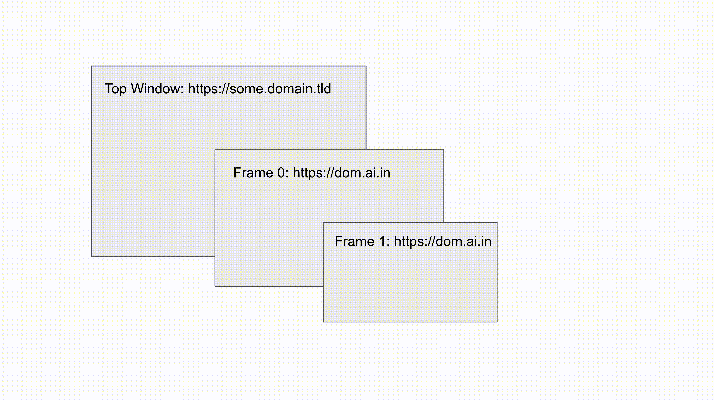

# Circumventing Browser Security Mechanisms For SSRF

## Background

While hacking on a private bug bounty program, we discovered a feature that generated screenshots of a user-controlled HTML page. We begun testing this functionality for SSRF. By inspecting the user agent, it was evident that a headless Chrome was being utilised to generate the screenshots.

Generally, when you come across a headless browser/chrome, you'll want to explore with framing internal resources, javascript execution, and communicating with chrome remote debugging. We were able to frame external sites and execute javascript, however it appeared as though we were encountering an issue while accessing internal resources, such as the Cloud metadata API.

## Problem

After debugging sometime, we realized what was going wrong. As our javascript execution occurred within iframes that were additionally restricted by sandbox attributes `allow-same-origin allow-forms allow-scripts allow-downloads allow-popups allow-popups-to-escape-sandbox allow-top-navigation-by-user-activation`, thus making us unable to simply redirect top's destination. Furthermore, we were unable to frame internal/external resources on "HTTP" due to the top being run on "HTTPS", doing so would trigger browsers' mixed content security control. So, we can't just simply frame http://169.254.169.254 and read AWS Cloud Metadata.

This image is representative of the environment.


However, because `frame[0]` and `frame[1]` share the same origin, we can simply rewrite the DOM of `frame[0]` or navigate to `top.frames[0]` and take control over `frame[0]` while completely eliminating `frame[1]` from picture. Now we were struck with another issue, one that appeared to be a dead end.


While digging into the issue, we discovered a minor detail in the user agent that provided us with further possibilities. The version of headless Chrome was out of date - `HeadlessChrome/85.0.4182.0`. While exploring Chrome exploits, we discovered a renderer exploit that provides remote code execution and is publicly available. There was even a full chain exploit, but no proof of concept was made public. Anyway, the renderer exploit failed to execute on target while it executed on our local machine, it appeared as though Chrome was running in its normal sandboxed mode (like it should!). :sad:

With only a fundamental understanding of renderer process exploits, we contacted [s1r1us](https://twitter.com/s1r1u5_), who had unquestionably more exposure to chrome-related vulnerabilities. He mentioned us that something along the same lines was used few days back to create his CTF Challenge ["Neutron"](https://twitter.com/S1r1u5_/status/1457193204655157251) for BSides Ahmedabad CTF with the help of [ptr-yudai](https://twitter.com/ptrYudai).

## Ways around the problem

At this time, we narrowed down to two ways which could potentially provide us access to "HTTP" resources and the fetched data.

1. Window.open() and read from memory

We were able to open a new window with AWS metadata from the iframe because of sandbox attribute 'allow-popups-to-escape-sandbox,' but we were unable to screenshot this earlier. Having a renderer exploit at our disposal and the fact that headless Chrome does not have site-isolation enabled by default, we may be able to develop an exploit that would allow us to read metadata from the memory.

2. Spoof `frame[0]`'s origin to top's origin thus giving us access to top.

Another way was to spoof `frame[0]`'s origin to match top's origin. This way, we'll end up on the same origin, allowing us to access top's DOM.

<br>
<p align="center">

</p>
<br>

The latter way is easier than the former one, because the same concept was used in the CTF challenge and the exploit is to write. But the prerequisite for the spoofing of the origin to work we need an XSS on the same-site of the top. In other words, we need a XSS on one of the subdomains of `domain.tld`. 

The former way is just an idea we had at that time if we were not able to find XSS in one of the subdomains. Usually, chrome creates Process-per-tab even with Site Isolation disabled, but we had a little hope that the headless chrome might use the same process for new windows which allows us to read the memory of newly created window. Furthermore, this exploit is little bit hard to write because we need to search memory for the AWS metadata and read it.

Anyway, we continuted with the second way and it nearly took us a week to fully exploit and take a screenshot of AWS metadata with origin spoofing. Let's dive into the details of it.

## Search for XSS on the subdomain of the top window.
As mentioned earlier, to carry on with the first way we need an XSS on the subdomain of the top window. Fortunately, we were able to find XSS on two subdomains without much effort. Let's assume we got XSS on `pwnz.domain.tld`.

This leaves us with the final part which is writing the exploit to spoof the origin of `pwnz.domain.tld` to `some.domain.tld`.

## Spoofing Origin between same-site sites

Please read [this](https://web.dev/same-site-same-origin/) blog to understand the difference between cross-site, cross-origin, same-site, same-origin before continuing.

In renderer process [SecurityOrigin](https://source.chromium.org/chromium/chromium/src/+/main:third_party/blink/renderer/platform/weborigin/security_origin.h) class has origin data(scheme, host, port, domain). With a renderer exploit this data can be modified to whatever origin we wanted, but this modification is useless in cross-site origins. For instance, modifying the origin information of http://a.com to http://some.domain.tld using the renderer exploit, doesn't bypass the same-origin policy.

Interestingly, modifying the origin information of same-site origins circumvents the same-origin policy. For instance, modifying the origin information of http://pwnz.domain.tld to http://some.domain.tld using the renderer exploit circumvents the same-origin policy. In other words, you can access DOM of http://some.domain.tld from http://pwnz.domain.tld.


The following path gives the offset to the `SecurityOrigin` object.

window -> LocalDOMWindow -> SecurityOrigin

```javascript=
var addr_window = addr_upper | addrof(window) + 0x18n; //window
console.log("[+] window = " + addr_window.hex());

var addr_ldomwin = aar64(addr_window) + 0x80n;  //LocalDOMWindow object
console.log("[+] LoclDOMWindow = " + addr_ldomwin.hex());

var get_sec_origin = aar64(addr_ldomwin + 0x110n); //SecurityOrigin object
console.log("[+] sec_origin_context " + get_sec_origin.hex());
var addr_sec = aar64(get_sec_origin + 0x110n + 0x10n);
console.log("[+] security_context = " + addr_sec.hex())

//var port = aar64(addr_sec+0x20n); // you can spoof the port which is at +0x20 from sec
//console.log("[+] port  = " + port.hex())

 var sec_host = aar64(addr_sec+0x18n); //host is at +0x18 from SecurityOrigin object
 console.log("[+] host String = "  + sec_host.hex())
/*Here we overwriting pwnz to some*/
 aaw32(sec_host, 0x656d6f73) //p32(0x656d6f73) = some
```

After spoofing the origin, we modified the DOM of top Window and created an iframe which points to AWS metadata. Here's GIF demonstration of the attack.



### Final Exploit - https://gist.github.com/rootxharsh/d3740298e1c5aff5120c0ecf8495b750

## Conclusion

Discovering and exploiting this vulnerability was a lot of fun. We ere able to include a browser exploitation technique into a web application vulnerability. It was a pleasure to work with @s1r1us on this finding. We had the opportunity to look into the Chrome security model in more detail.

Thank you for taking the time to read this! If you enjoyed this and other articles in this repository, please consider retweeting and following [HTTPVoid on Twitter](https://twitter.com/httpvoid0x2f). Contact us at hello [@] httpvoid.com if you believe we can be of assistance to you with your security needs.